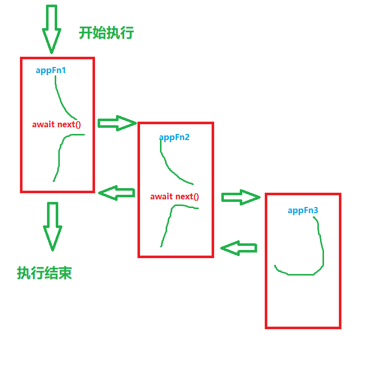

node
===

## 1、理解koa 的洋葱模型


```js

const  Koa  =  require('koa');
const  app  =  new  Koa();

// 第一层洋葱皮 ctx 为context 上下文
app.use(async  function  appFn1(ctx,  next)  {
	const  start  =  Date.now();
	console.log(1);
	await  next();
	console.log(5);
	const  ms  =  Date.now()  -  start;
	ctx.set('X-Response-Time',  `${ms}ms`);
});

// 第二层洋葱皮
app.use(async  function  appFn2(ctx,  next)  {
	const  start  =  Date.now();
	console.log(2);
	await  next();
	console.log(4);
	const  ms  =  Date.now()  -  start;
	console.log(`${ctx.method}  ${ctx.url} - ${ms}`);
});

// 第三层洋葱皮
app.use(async  function  appFn3(ctx)  {
	ctx.body  =  'hello World';
	console.log(3);
});

// 代码的执行顺序是 1 2 3 4 5
app.listen(3000);
```
代码执行顺序，注：不能保证`next()`后执行的是否是异步操作，因此在`next`前要加`await`
 
> 1.  最外层的中间件首先执行。
> 2.  调用`next`函数，把执行权交给下一个中间件。
> 3.  ...
> 4.  最内层的中间件最后执行。
> 5.  执行结束后，把执行权交回上一层的中间件。
> 6.  ...
> 7.  最外层的中间件收回执行权之后，执行`next`函数后面的代码。


