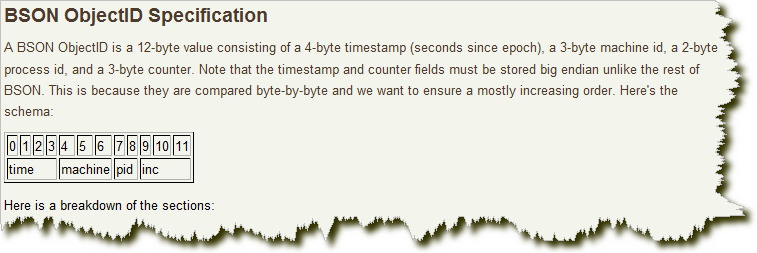

chinese 中学语文项目
===
> 云服务地址：（无域名）http://140.143.11.197/

把项目部署到服务器端，折腾历程

### 1、安装node
使用nvm安装node的任意版本
引用自 https://cnodejs.org/topic/598954d9206061d87545c5d3

 *   安装nvm

```
curl -o- https://raw.githubusercontent.com/creationix/nvm/v0.33.2/install.sh | bash
```
nvm安装成功后，关闭当前终端，重新连接 
* 验证安装是否成功
```
nvm --version
```
看到输出版本信息0.33.2表示安装成功

*   查看Node.js版本并安装
```
nvm ls-remote 
nvm install v8.2.1
```
* 测试node 是否安装成功
```
node -v
```
### 2、安装git

> https://segmentfault.com/a/1190000007134786


### 3、安装mongodb
from http://www.qingpingshan.com/pc/fwq/166274.html

### 4、使用ssh连接gcp服务
* 这里使用putty和winSCP 连接，当然直接使用 google的ssh也是可以，前提是不能把原有的ssh给删了，也不能把防火墙规则给关了
* gcp端，保留的为公钥，本地端保留的为私钥，需要把私钥的格式使用 putty中的一个工具改为ppk格式


### 5、启动服务

linux 守护进程启动
> http://www.ruanyifeng.com/blog/2016/02/linux-daemon.html 

```shell
node index & //  在进程后面添加&
```
日志也会打印出来

### 6、tming.win 的问题

* 一些页面交互需要优化
* 接口返回值内容太多需要用gzip压缩 ok
* 详细的文章内容，不需要一次都返回，加快速度 ok
* 使用https访问
* 服务开机自启动，
* 服务子进程启动
* 通过github管理前后端代码，实现自动化的更新 部署 启动 devOps 部分实现
* 学习linux命令  http://cn.linux.vbird.org/linux_basic/linux_basic.php  认识系统服务

### 7、安装pm2

使用pm2管理node进程

> 官网 http://pm2.keymetrics.io/
https://www.cnblogs.com/chyingp/p/pm2-documentation.html


```shell
pm2 start index.js -n chinese // 使用pm2启动 index文件服务，并且指定名称为 chinese -n name
```
### 8、使用shell 
自动获取最新代码、编译、部署、重启服务

* shell 和文件目录切合紧密，不能够复用
* linux系统中换行为LF `\n` ，window系统中换行为CRLF`\r\n`编写文件时要注意

```shell
# shell for update serve

# code backup

# for server code

cd /home/test/chinese

git pull

cd ..

cp -r chinese/. server

# for static web code

cd chinese-web

git pull

npm install

npm run build

cp -r dist/. ../server/src/static

# restart service

cd /home/test/server/src

pm2 restart index.js -n chinese
```

### 9、部署过程中的小问题

*	chinese-web模块依赖中的`node-sass`安装不当导致build失败，重新安装`node-sass`


### 10、mongodb

mongodb 文档文档中的：_id，ObjectID

> https://cnodejs.org/topic/559a0bf493cb46f578f0a601

前面说了：‘_id’是mongodb ObjectID类型的，它由12位结构组成，包括timestamp, machined, processid, counter 等



### TimeStamp
前 4位是一个unix的时间戳，是一个int类别，我们将上面的例子中的objectid的前4位进行提取“4df2dcec”，然后再将他们安装十六进制 专为十进制：“1307761900”，这个数字就是一个时间戳，为了让效果更佳明显，我们将这个时间戳转换成我们习惯的时间格式

$ date -d ‘1970-01-01 UTC 1307761900 sec’ -u 2011年 06月 11日 星期六 03:11:40 UTC

前 4个字节其实隐藏了文档创建的时间，并且时间戳处在于字符的最前面，这就意味着ObjectId大致会按照插入进行排序，这对于某些方面起到很大作用，如 作为索引提高搜索效率等等。使用时间戳还有一个好处是，某些客户端驱动可以通过ObjectId解析出该记录是何时插入的，这也解答了我们平时快速连续创 建多个Objectid时，会发现前几位数字很少发现变化的现实，因为使用的是当前时间，很多用户担心要对服务器进行时间同步，其实这个时间戳的真实值并 不重要，只要其总不停增加就好。
### Machine

接下来的三个字节，就是 2cdcd2 ,这三个字节是所在主机的唯一标识符，一般是机器主机名的散列值，这样就确保了不同主机生成不同的机器hash值，确保在分布式中不造成冲突，这也就是在同一台机器生成的objectid中间的字符串都是一模一样的原因。

### pid

上面的Machine是为了确保在不同机器产生的objectid不冲突，而pid就是为了在同一台机器不同的mongodb进程产生了objectid不冲突，接下来的0936两位就是产生objectid的进程标识符。

### increment

前面的九个字节是保证了一秒内不同机器不同进程生成objectid不冲突，这后面的三个字节a8b817，是一个自动增加的计数器，用来确保在同一秒内产生的objectid也不会发现冲突，允许256的3次方等于16777216条记录的唯一性。
