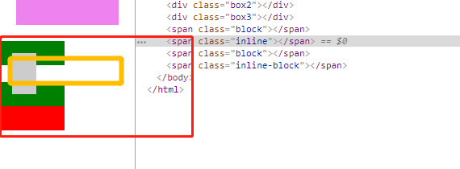

# css
## 由css的transform：rotate引发的一系列的问题
> 一些资料
1、有关于transform的matrix详见：张鑫旭css
http://www.zhangxinxu.com/wordpress/2012/06/css3-transform-matrix-%E7%9F%A9%E9%98%B5/
* transform:translate(x,y)  ---> transform: matrix(1,0,0,1,x,y);
* transform:scale(x,y) ---> transform:maxtrix(x,0,0,y,0,0);
* transform:rotate(θ) ---> matrix(cosθ,sinθ,-sinθ,cosθ,0,0);
* transform:skew(x + 'deg', y + 'deg') ---> matrix(1,tan(θy),tan(θx),1,0,0);

> sin(x + y) = sin(x)cos(y) + cos(x)sin(y)
cos(x + y) = cos(x)cos(y) -sin(x)sin(y)
http://math2.org/math/algebra/functions/sincos/properties.htm


* 对于做旋转动画的元素而言，通过`getComputedStyle(ele).transform`可以实时的计算出元素的旋转量，会发现其角度是一直在增加了，也可以认为是一直是0-2PI
* 对于一个做旋转动画的元素，如下代码所示，当动画设置`animation-play-state:paused`时动画停止，此时动画元素的旋转量为0；（即恢复到了初始状态）
* 在音乐播放器实例中，cd的旋转表明了歌曲播放状态，点击暂停时，为了保持cd的偏移状态，需要使用外部容器记录旋转状态，这就需要让外部容器的旋转角度加上内部图片的角度；这便涉及到以上所提到的问题。
```
    @keyframes rotate {
      0% {
        transform: rotate(0);
      }
      100% {
        // deg 角度单位 360deg
        // rad 弧度单位 3.1415926rad * 2
        transform: rotate(3.1415926rad * 2);
      }
    }
    animation-play-state: paused;
```

### 2、正文页右侧广告或者菜单固定的问题
> 当网页内容过长时，保证右侧导航或广告始终固定到页面右侧
> juejin的实现是拷贝一份DOM，滚动到一定程度的时候显示
> 这种方式，1、体验好；2、不会影响原有的样式

* 就用户体验而言，应尽量避免，只有中间区域滚动；这不符合大多数用户的做法

### 3、html body window 显示元素
结论如下：（在IE8-11，EDGE，chrome（最新）火狐（最新））
* 显示元素中，根元素为window（浏览器窗口）不是html和body;html和body都可以设置`margin padding`属性
* html的高度完全是由body来决定的，在没有手动设置的情况下；
* 在设置body为`overflow:hidden,auto`（当然body为定高）的情况下，只有同时设置html为`overflow`不为默认值得情况下才能生效

原因分析：（可能并不准确）
是html和body作用在一起共同控制页面元素的显示，而html body默认的`overflow`属性是visible，而body是html元素下唯一能够在页面显示的元素，其特性和div元素并不一致


### 4、伪类选择器

* 伪类选择器的有限级要比单独的选择器优先级高，即`p:nth-child(2)` > `p`
* 伪类选择器是对选中后的元素，再次遍历 不同的选择器遍历规则不同
* `:first-child,:last-child,:nth-child()` 会根据获取到的元素，所在父元素的次序来查找，`first `该元素是父元素中的第一个子元素
* `:first-of-type,:last-of-type,:nth-of-type()` 会根据获取到的元素，相对于兄弟元素的位置来决定
* `:checked,:enabled,:disabled` 都是功能性选择器


### 5、块级元素和内联元素
块级元素独占一行，内联元素无法设置，宽高设置的padding和margin中，只有left 和right才会生效。对于margin top和bottom在布局。对于padding top 和bottom 会影响元素本身，但是不会影响其他元素。

如图所示，虽然灰色块的`padding top bottom`确实设置了，但其不会影响其余元素的定位；



### 6、关于BFC（Block Formating Contexts）块级格式化上下文

只要元素满足下面任一条件即可触发 BFC 特性：
*	body 根元素
*	浮动元素：float 除 none 以外的值
*	绝对定位元素：position (absolute、fixed)
*	display 为 inline-block、table-cells、flex
*	overflow 除了 visible 以外的值 (hidden、auto、scroll)

有三个特性：
* 1. 同一个 BFC 下外边距会发生折叠
* 2. BFC 可以包含浮动的元素（清除浮动）
* 3. BFC 可以阻止元素被浮动元素覆盖

详细见： https://zhuanlan.zhihu.com/p/25321647

### 7、一些兼容性的问题

- 7.1  Chrome 中文界面下默认会将小于 12px 的文本强制按照 12px 显示

解决方法：可通过加入 CSS 属性 -webkit-text-size-adjust: none; 解决


### 8、链接伪类样式
`:link` a标签为链接是生效，若a标签无`href`则不生效
`:visited`  表明该标签已经访问过，无论放置的位置如何，其优先级高于`:link`
前两类表明了链接的状态，未被访问过和已访问过

`:hover` 悬浮到a链接上
`:active` 点击时，从触发情况来看，active在hove之后
后两类描述了a链接的交互状态，悬浮时或者点击时；因此书写样式时，为了能让样式更好的展现，active要方到hover后面，并且两者都要放到 link和visited后面；

### 9、border-image 

> http://www.zhangxinxu.com/wordpress/2010/01/css3-border-image/


关于`border-image`内容参考以上。用到为三个属性：url() 表示图片地址， 数字slice 表示裁切位置，stretch 、repeat、round。表示重复性；
`border-image`和`background-image`属性表示很相似，只是`border`涉及到图片的裁切，而背景图是指图片的位置偏移。
```css
border-image: url('./i/img.png') 30 round;
```

### 10、移动端适配

> vw移动端适配： https://www.w3cplus.com/css/vw-for-layout.html
> 在Vue项目中使用vw：https://www.w3cplus.com/mobile/vw-layout-in-vue.html

- 解决`retain`屏下的1px的边框的问题
- 使用`vw vh vmin vmax`单位解决移动端适配的问题
- `vw`解决方案、现有的项目组件和weui样式整合

### 11、事件系统


