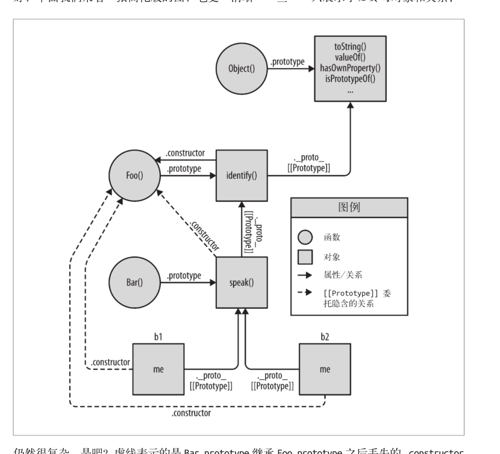

# js
> https://43.240.139.9 堡垒机地址

### 1、Math数学运算
* Math.cos Math.sin Math.tan Math.acos Math.asin Math.atan 数据的单位为弧度
* `Math.PI / 180` 即可完成deg(角度) -> rad(弧度)
* css 中`transform:rotate(30deg)`角度单位 deg rad
* 一个数学问题，单独的cos值或者sin值是无法得到真实的角度（0-2PI）内的，需要sin和cos值

### 2、Vue中的computed计算属性和watch
> 计算属性会自动追踪依赖，只有当依赖值发生变化的时候，才会重新计算；
> 我们可以将同一函数定义为一个方法而不是一个计算属性。两种方式的最终结果确实是完全相同的。然而，不同的是计算属性是基于它们的依赖进行缓存的。计算属性只有在它的相关依赖发生改变时才会重新求值。这就意味着只要 message 还没有发生改变，多次访问 reversedMessage 计算属性会立即返回之前的计算结果，而不必再次执行函数。
> Vue 提供了一种更通用的方式来观察和响应 Vue 实例上的数据变动：侦听属性。当你有一些数据需要随着其它数据变动而变动时，你很容易滥用 watch——特别是如果你之前使用过 AngularJS。然而，通常更好的做法是使用计算属性而不是命令式的 watch 回调。
> js的数据类型分为两类：基本数据类型和对象

对于赋值而言，基本数据类型进行值传递，而对象赋值则是引用传递；
自动追踪依赖意味着，无法对计算属性做自定义配置，这时watch似乎更好些；Vue有自己的设定规则，这意味着有时Vue并不能满足你的所有需求，最好的方式就是，依照推荐的方式换一种实现思路；
对于基本数据类型而言，值发生变化意味着 watch 和 依赖于此的computed都要重新计算
对于对象，只有当对象引用发生变化的时候，依赖于此的 computed和watch 才会重新计算
测试代码如下
```
data() {
  reutrn {
    obj: { name: 'xxx', yy: 0}
  }
},
watch: {
  obj(val) {
    console.log('watch ', this.val);
  }
},
computed: {
  my() {
  	console.log('对my重新计算');
    return this.obj.yy;
  }
},
methods: {
  changeObj() {
    // this.obj = { name: new Date().getTime() };
    this.obj.name = new Date().getTime();
  }
},
updated() {
  onsole.log('obj', JSON.stringify(this.obj));
  console.log('my', JSON.stringify(this.my));
},
created() {
  const _this = this;
setInterval(() => {
  _this.changeObj();
  }, 1000);
}

```
### 3、touch事件
当touchstart在很小的元素上触发时，即便touch移动到元素外，touchmove、touchend事件依旧会触发
在VUE中动态设置样式，可以通过提供的`:style`或者`:class`扩展来实现，但是对于某些样式的获取和设置，比如`transform`直接通过DOM获取和设置时比较好的；
补充：对于VUE所擅长的数据渲染完全可以放心的使用，但是对于DOM宽度高度计算而言（需要确定DOM的状态后才能计算）直接计算比较好；
有两种设置样式的思路：
* 1、`:style="{ width: `${offsetWidth}px`}"`直接设置，受Vue影响比较严重，必须要考虑DOM是否加载的情况；
* 2、拿到DOM的引用设置DOM，不受VUE的影响，代码可能会有庸余；

DOM 中的值client(本身)，offset(偏移)，scroll(滚动)

### 4、vuex 全局的数据中心，
实现一个全局的单例，用来进行组件间的数据传递，控制数据的修改访问；vuex包含了全局数据的存储state、读取getter、修改setter；vuex中不应该包含大量的计算逻辑；计算逻辑应该由组件来做，或者getter来做
使用vuex之前应该问的问题：
为什么要用vuex？不用行吗？
有什么数据需要放到vuex里面进行管理？好处坏处？
我是不是把复杂的处理逻辑也放到vuex里面了？

### 5、async JS异步处理（初步指导思路）
* 单个异步处理使用 `promise`
* 异步并发处理 `promise.all`
* 顺序异步 使用 `async await`

**Promise**
Promise 中一旦执行了resolve或者reject，Promise本身的状态就会发生改变，并且不能再次改变；
Promise 构造函数中的错误可以被其后的catch捕获到；
以下情况不能捕获到，程序会在执行到`aaa * 1`就报错，并且不会调用then回调
```
new Promise((resolve, reject) => {
	setTimeout(() => {
    	resolve(aaa * 1);
	},1000);
});
```

异常处理，异常分为两种：1、程序运行抛出的异常，如果异常未被捕获，程序运行终止
2、用户自定义异常；通过`Error`类构造出的自定义异常；`const err = new Error('error')`程序不会报错，`Error`类和其他的类一样可以被调用和赋值；要想提示异常需要使用`throw err`;而这两类异常都是`Error`类的示例

> throw语句用来抛出一个用户自定义的异常。当前函数的执行将被停止（throw之后的语句将不会执行），并且控制将被传递到调用堆栈中的第一个catch块。如果调用者函数中没有catch块，程序将会终止。

>  try...catch语句将能引发错误的代码放在try块中，并且对应一个响应，然后有异常被抛出；catch能够捕获程序异常和自定义异常；

```
const err = new Promise((resolve, reject) => {
	setTimeout(() => {
    	resolve(new Error('errorrrrrr'));
    }, 1000);
});
err.then((res) => {
	console.log('then',res);
}).catch((err) => {
	cosnole.log('catch',err)
});
// output
// then Error: errorrrrrr
    at setTimeout (<anonymous>:3:14)
```

### 6、正则表达式
> .（小数点）匹配除换行符之外的任何单个字符。
> [\s\S] [^] 能匹配包括 \n 在内的所有字符

\S 非空白字符
\s 匹配空白字符 包括：空格、制表符、换页符和换行符；

一下内容对应的字符，只是表明了位置，并不代表任何字符，也就是**零宽**
\b 匹配一个词的边界
\B 匹配一个非单词边界
^ 字符开始
$ 字符结尾

肯定预测 positive lookahead (?=xx) 肯定，匹配列表中必须有xx,
Match a group after main expression without including it in the result;
否定预测 negative lookahead (?!) 否定，匹配列表不能有xx；
specifices a group that can not match after main expression(if it is matches,the result is discarded);

```
const reg1 = /\b\d/g;
const reg2 = /\b\d(?=px)/g;
const reg3 = /\b\d(?!px)/g;
const str = '1px 2em 3pt 4px';

console.log(str.match(reg1));// [ '1', '2', '3', '4' ]
console.log(str.match(reg2));// [ '1', '4' ] 匹配一个数字，数字后面要有px，返回数字
console.log(str.match(reg3));// [ '2', '3' ] 匹配一个数字，数字后面不能有px，返回数字

```
```js
var reg = /^(?!0[0-9]\d{14})(?!1[0-5]\d{14})(\d{10}[345]{1}[a-zA-Z0-9]{1}\d{4})$/;
```
否定预测，匹配的16个数字中，不能含有`0x{15}` ，`1[0-5]x{14}`前两位必须大于15（不包括15），`(?!)`放到最前面的意思是，在匹配开始前就要排除这种情况；然后只选择前两位大于15 并且第十一位为[345] 第12位可以是数字字母13-16必须为数字


如一下表明要匹配三个连续相同的字符，并且后面没有三个连续相同的字符
\1 \2 \3 表示匹配到的字符组；

```
var s = 'aaalllsss0tAAAnnn999';
var reg = /(\w)\1{2}(?!(\w)\2{2})/g;

console.log(s.match(reg));// [ 'sss', '999' ]
```
最后一问：
```
var web_development = "python php ruby javascript jsonp perhapsphpisoutdated";
```

找出其中 包含 p 但不包含 ph 的所有单词，即

[ 'python', 'javascript', 'jsonp' ]

引用一个大神的答案
> https://stackoverflow.com/questions/39570875/find-all-words-that-contains-p-but-not-ph/39571868#39571868
```
\b(?:p(?!h)|[^p\s])*?p(?!h)(?:p(?!h)|[^p\s])*?\b
```


### 7、字符串的操作
`str.substr(start,length)` 从指定位置获取指定长度的字符串
`str.substring(start,end)` 返回开始和结束位置的字符串


### 8、XHR对象的header
> 浏览器不允许用户手动设置敏感的Http header
包括但不限于
cookie
host
referer

因此 XHR请求中的host和referer是无法通过手动来设置的

### 9、VUE js 源码学习
http://hcysun.me/2017/03/03/Vue%E6%BA%90%E7%A0%81%E5%AD%A6%E4%B9%A0/


### 10、字符编码
>  https://www.cnblogs.com/gavin-num1/p/5170247.html   很好的介绍性文章；

计算机的符号有两种0,1；人类语言的符号则有很多，要想让语言符号能够在计算机系统之间传播必须要对字符进行编码；
* ASCII 对英文字符进行了编码；用8bit两个字节byte表示了128个符号；
* 为了能够在计算机中处理汉字，国家标准出台了GBK标准，兼容原有的ACSII并添加了独一无二的汉字，并编码了汉字对应的码集；（GBK GB2312 ...）
* Unicode 编码，将世界上所有的符号都纳入其中，每一个符号都有一个独一无二的编码；它规定了符号的二进制代码；同样也是ASCII的超集；原有的ASCII不变
* Unicode 编码是一个符号集，他只规定了符号的二进制代码，却没有规定这个二进制代码如何存储；


utf-8是unicode 的一种实现；

js中：escape 返回：返回一个字符的Unicode编码值；对应的解码为unescape
encodeURI 返回内容的编码方式，decodeURI解码；不对“; / ? : @ & = + $ , #”英文 数字编码
encodeURIComponent decodeURIComponent 对所有内容进行编码

JavaScript的字符串本来就是unicode，即不存在utf-8的字符串，也不存在gb2312的字符串；（utf-8和GB312为了存储而实现的）

``` js
const str = '你好 utf8';//
console.log(escape(str));// 返回str的unicode编码
console.log(encodeURI(str));// 返回中文的utf-8的编码（通常用于url上内容传递，因此要进行编码）
```

node.js中的 描述二进制的对象，buffer是有文件格式的可以是 utf-8 也可以是 gbk的，因此在解码的时候需要对buffer进行解码，使用`iconv-lite`

Q&A:
- 1、js中的utf-8编码，这种说法对吗？
ans：不对，js中所有的代码都是unicode（前提示文件为utf-8格式）；utf-8或者gbk都是文件存储的方式；也就是说涉及到文件存储的时候才有编码方式这一说；存储也就是对原有的unicode码的在编码；
- 2、js中涉及到文件编码的有哪些？
ans：直接读取文件时，服务器接受内容时，都是以流的方式进行存取，此时的流是有编码方式的；需要用正确的编码方式才能打开，否则的话就会出现乱码；
- 3、乱码？
ans：要想正确的打开一个文件，必须知道文件的编码方式，用utf-8的方式去打开GBK文件肯定是乱码的

### 11、js ES6+

* 后续的ES新增内容为ES5的扩充，这也就意味着，老式的js程序仍然可以在新式的浏览器中运行，原有的js写法不会发生变化，ES+标准推荐使用新的方式去书写，以便能编写出更健壮的代码；同时也就意味新增的内容也是遵循原有的规范的；


### 12、对象的valueOf toString方法
对象的`valueOf`方法能够返回对象的**原始值**（primitive），默认情况下object的原始值是对象本身，对一些js中的核心对象，返回值又各有各的不同
| 对象| 返回值 |
|---|---|
| Array | 返回数组对象本身。 |
| Boolean| 布尔值。|
| Date| 存储的时间是从 1970 年 1 月 1 日午夜开始计的毫秒数 UTC。（返回值类型为number）|
| Function| 函数本身。 |
| Number| 数字值|
| Object| 对象本身。这是默认情况。 |
| String| 字符串值。|
|Math Error| Math 和 Error 对象没有 valueOf 方法。|

**valueOf** 方法返回对象的原始值，不经常使用
**toString**方法返回对象的字符串表示，在隐式类型转换中会用到
```js
var obj = {
  name: 'hello',
  age: 12
};

obj.toString = function () {
	console.log('obj 调用了toSting方法');
	return obj.name + obj.age;
}
var str = '这是一个str';

console.log(str + obj);// 这是一个strhello12，调用了toString方法

obj = {};

console.log(str + obj);// 这是一个str[object Object]，默认toString返回'[object Object]'
```
### 13、javascript 中的复制
js中的函数（用标准、可靠的方法）真正地复制，所以你只能复制对共享函数对象的引用；
其他内容则可以通过`JSON.parse(JSON.stringify())`所以应当尽量避免复制操作的设计；
一定要注意，只在能够提高代码可读性的前提下使用显式混入，避免使用增加代码理解难、度或者让对象关系更加复杂的模式。
js中使用prototype原型的方式实现类和继承

**Prototype** 原型继承
**`for in`**使用 for..in 遍历对象时原理和查找 [[Prototype]] 链类似，任何可以通过原型链访问到（并且是 enumerable ，参见第 3 章）的属性都会被枚举。**`in`**使用 in 操作符来检查属性在对象中是否存在时，同样会查找对象的整条原型链（无论属性是否可枚举）：
* 对于从对象上获取属性来说，`obj.name`会触发原型链的查询，否则会返回`undefined`
* 对于从对象上设置属性来说，若原型链上存在该属性，赋值时会有不同（根据不同的情况进行赋值）


```js
var obj = {};
obj.a = 5;
var inhertObj = Object.create(obj);

inhertObj.a ++;// inhertObj.a = inhertObj.a + 1;

console.log(inhertObj.a);// 6
console.log(obj.a);// 5
```
注意在执行以上操作时产生的隐式委托
Javascript和面向类的语言不同，它并没有类来作为对象的抽象模式或这蓝图；实际上，JavaScript 才是真正应该被称为“面向对象”的语言，因为它是少有的可以不通过类，直接创建对象的语言。
**JavaScript 中只有对象**

> Javascript中通过原型继承，来实现对象的继承，通常这是动态语言版本的类继承；和通常面向对象的语言的类继承*几乎是完全相反的*行为；
> 继承意味着复制操作，JavaScript（默认）并不会复制对象属性。相反，JavaScript 会在两个对象之间创建一个关联，这样一个对象就可以通过委托访问另一个对象的属性和函数。委托（参见第 6 章）这个术语可以更加准确地描述 JavaScript 中对象的关联机制。

javacript 使用委托设计模式，实现继承。而不是通过类的设计模式
委托行为意味着某些对象（ XYZ ）在找不到属性或者方法引用时会把这个请求委托给另一个对象（ Task ）。
这是一种极其强大的设计模式，和父类、子类、继承、多态等概念完全不同。在你的脑海中对象并不是按照父类到子类的关系垂直组织的，而是通过任意方向的委托关联并排组织的。

js委托继承
b1 b2为Bar的实例，Bar继承自Foo，Foo继承自Object，===>
`Bar.prototype.__proto__ === Foo.prototype`
`Foo.prototype.__proto__ === Object.prototype`



* 过程式代码 简单 易懂 流程清晰明了 ----- 维护不方便

* 面向对象式 复杂 抽象 ---- 易于维护和扩展

**总结**

这种模式被称为“鸭子类型”。这个术语源自这句格言“如果看起来像鸭子，叫起来像鸭子，那就一定是鸭子。”
```js
var obj1 = {};
var fn1 = function () {}

obj1 instanceof fn1;// false
obj1.__proto__ === fn1.prototype;// false
obj1.__proto__ = fn1.prototype;

obj1 instanceof fn1;// true

// 可以使用 isPropertyOf  Object.getPropertyOf() 来判断
```


在软件架构中你可以选择是否使用类和继承设计模式。大多数开发者理所当然地认为类是唯一（合适）的代码组织方式，但是本章中我们看到了另一种更少见但是更强大的设计模式：行为委托。

行为委托认为对象之间是兄弟关系，互相委托，而不是父类和子类的关系。JavaScript 的[[Prototype]] 机制本质上就是行为委托机制。也就是说，我们可以选择在 JavaScript 中努力实现类机制（参见第 4 和第 5 
章），也可以拥抱更自然的 [[Prototype]] 委托机制。

当你只用对象来设计代码时，不仅可以让语法更加简洁，而且可以让代码结构更加清晰。

对象关联（对象之前互相关联）是一种编码风格，它倡导的是直接创建和关联对象，不把它们抽象成类。对象关联可以用基于 [[Prototype]] 的行为委托非常自然地实现。

### 14、运行错误和变量提升

在web端的js中
```js
<script src="a.js"><script>
<script id="inner">

</script>
<script src="b.js"><script>
```
* 变量提升存在于单独的js文件中，两个文件（包括内敛的script）是不能交叉的；（即b.js文件中的变量和函数是无法，在变量提升阶段，在a.js文件中被使用的）

* 同样变量提升也存在于 `function`里

js运行时出现错误会导致程序在运行处终止，（在没有被捕获的情况下，错误会被抛出）；而无论是否被捕获，错误后续的代码将不会执行；

js代码分为，立即执行

### 15、异步的解决方案

`Promise` ---> `async await`都是基于 *Promise*，一定要熟知Promise，并且要把异步编程风格往Promise靠拢，使用Promise对原有的异步处理进行封装。

### 16、开源项目
* README上会有详细的介绍
* 项目代码会包含源码、校验控制、脚本命令（用于检查，发布）、用例、发布
* 通常情况下源码会用rollup、gulp、grunt来做工程，并且源码文件拆分的足够详细、文件变量命名很规范优雅、注释很详细。


### 17、artTemplate 分析
实质就是把模板引擎编写字符串转换成函数字符串，然后在使用
```js
new Function(a, b, fnString); 的方式生成新的函数，调用函数即可
```
模板中的预编译技术是指，对生成后的`function(...)`代码，其对应的变量都会提前声明好。

### 18、JS API
```js
window.location === document.location;// true
location.reload(true);// 强制刷新，不使用缓存。不传参数或为false；刷新使用缓存

navigator.userAgent;// 用户代理字符串，用于判断客户端类型
````
对不同的浏览器兼容问题，处理方案；尽量避免使用兼容性不好的API，先设计通用的方案，然在使用特定于浏览器的技术增强方案
node一些DOM节点的方法
```js
hasChildNodes();// 
insertBefore(ele1,ele2);// 
replaceChild();
document.domain;// 通过设置domain可以解决在frame页面中，不同子域名的跨域问题
```
### 19、chrome 调试

`F8` 跳到下一个断点
`F10`单步调试，不进入方法
`F11`单步调试，遇到Function进入方法单步

### 20、vue transiton 


1.  `v-enter`：定义进入过渡的开始状态。在元素被插入时生效，在下一个帧移除。

2.  `v-enter-active`：定义过渡的状态。在元素整个过渡过程中作用，在元素被插入时生效，在 `transition/animation` 完成之后移除。这个类可以被用来定义过渡的过程时间，延迟和曲线函数。

3.  `v-enter-to`: **2.1.8版及以上** 定义进入过渡的结束状态。在元素被插入一帧后生效 (于此同时 `v-enter` 被删除)，在 `transition/animation` 完成之后移除。

4.  `v-leave`: 定义离开过渡的开始状态。在离开过渡被触发时生效，在下一个帧移除。

5.  `v-leave-active`：定义过渡的状态。在元素整个过渡过程中作用，在离开过渡被触发后立即生效，在 `transition/animation` 完成之后移除。这个类可以被用来定义过渡的过程时间，延迟和曲线函数。

6.  `v-leave-to`: **2.1.8版及以上** 定义离开过渡的结束状态。在离开过渡被触发一帧后生效 (于此同时 `v-leave` 被删除)，在 `transition/animation` 完成之后移除。

其中`v-enter-to`  `v-leave-to`会存在整个的transition-duration时间中，因此
```css
.fade-enter-active,
.fade-leave-active {
	transition:  all  ease  0.5s;
}

.fade-enter,
.fade-leave-to {
	opacity:  0;
	transition: scale(0, 0);// 能保证在进入动画时，fade-enter ===> fade-enter-to 为方法动画
}
	// 
.fade-enter-to,
.fade-leave {
	opacity:  1;
	transition: scale(1, 1);
}
```
> http://ds-overdesign.com/transform/matrix.html

在线的变换
使用transition：的多个属性变换的时，使用`metrix`更好些

****

### 21、== 运算
> 引用自： https://zhuanlan.zhihu.com/p/21650547

**结论**
前面说得很乱，根据我们得到的最终的图3，我们总结一下==运算的规则：

*   **undefined == null**，结果是**true**。且它俩与所有其他值比较的结果都是**false**。
*   **String == Boolean**，需要两个操作数同时转为Number。
*   **String/Boolean == Number**，需要String/Boolean转为Number。
*   **Object == Primitive**，需要Object转为Primitive(具体通过**valueOf**和**toString**方法)。

瞧见没有，一共**只有4条规则**！是不是很清晰、很简单。
