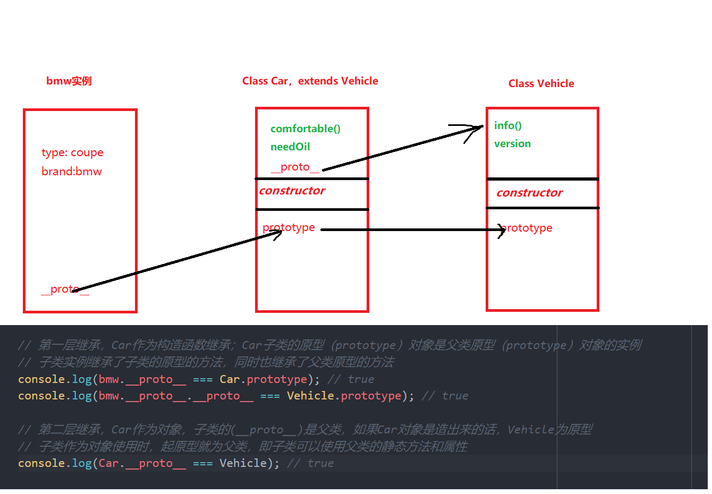
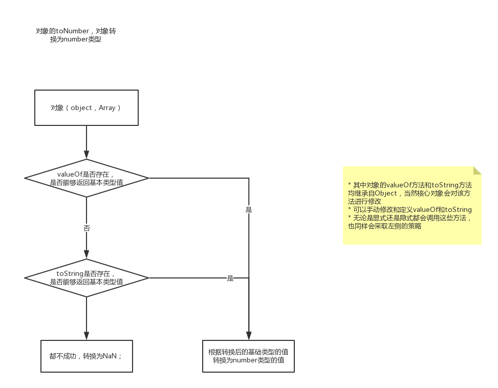

js书籍
===

# 你不知道的javascript

## 1、作用域

### 1.1  js的执行分为两个阶段

*   编译阶段，编译阶段会处理代码中的声明，并把变量放置与作用域中存储；并生成可被js引擎执行的代码

```js
  var x = 2;// 编译阶段处理var x ，对x进行声明 ，x = 2 为赋值语句，需要js引擎去执行
  function foo (a) {console.log(a)};// 编译阶段对函数进行声明，声明的同时对其已经赋值了（函数特殊）
```

*   js引擎执行阶段，引擎执行编译生成的代码；引擎执行时，面对变量会在作用域内进行查找
>   查找分为LHS引用，和RHS引用；简单来说LHS，找到变量容器本身，并进行赋值；RHS则是找到源式值
>   函数执行时，函数内部的代码会再次执行一次，同样也会走编译--执行的流程；

*   函数的词法作用域，无论函数在哪里被调用，也无论它被如何调用，它的词法作用域只是由函数被声明时所处的位置所决定的；（作用域是由编译阶段所确定的，也是由书写时函数声明的位置所决定的，编译的词法分析阶段基本能够知道全部的标示符在哪里以及是如何声明的，从而能够预测在执行过程中如何对他们进行查找）
*   不要使用`with` 和 `eval`，这样会使得程序无法对代码进行优化；

### 1.2 闭包

> 无论通过何种方式将内部函数传递到所在的词法作用域之外，它都会持有对原始作用域的引用，无论在何处
> 由于函数可以被当成第一级的值并到处传递，那么函数在执行时，会带有对：由函数定义时形成的词法作用域的引用，这就是闭包
> 只要使用了**回调函数** 就是在使用闭包

*   无论函数是具名函数还是匿名函数，实际上都牵扯到了函数的定义，通常情况下，匿名函数不仅在声明函数而且会把函数传递到对应执行器中去；比如
*   函数的作用域，是由函数定义时决定的，也就是位置决定的


```js
setTimeout(function () {...}, 1000);// 实际上当执行到此的时候，同样会对函数进行定义，只不过没办法在此引用这个函数，并且函数会被传递到执行器中
axios.get(url).then(function () {...})

```

*   闭包也可以这样去理解，当函数作为值进行传递的时候，函数的作用域如何处理
*   到了ES6，`let` 和 `const` 会使得代码块`{}` 变成块级作用域，同样会实现闭包的效果
*   通过JS的任何值都能作为返回值的特性，使用函数可以实现模块的功能（当然ES6 module是原生实现）模块
*   ES6模块：1、js原生支持的；2、js运行时，编译器会在编译阶段检查导入的模块API成员的引用是否存在，若不存在会抛出早期的错误；


```js
    function module () {
    var a = '12';
    var b = [1,2,5];

    function doSomething () {
        ...
    }


    function doElseSomething () {
        console.log(a);
    }

    return {
        doSomething: doSomething,
        doElseSomething: doElseSomething
    }
    }
    var x = module();
    x.doSomething();
```

## 3、对象

JavaScript 中的对象有字面形式（比如 var a = { .. } ）和构造形式（比如 var a = new
Array(..) ）。字面形式更常用，不过有时候构造形式可以提供更多选项。

许多人都以为“JavaScript 中万物都是对象”，这是错误的。对象是 6 个（或者是 7 个，取
决于你的观点）基础类型之一。对象有包括 function 在内的子类型，不同子类型具有不同
的行为，比如内部标签 [object Array] 表示这是对象的子类型数组。

对象就是键 / 值对的集合。可以通过 .propName 或者 ["propName"] 语法来获取属性值。访
问属性时，引擎实际上会调用内部的默认 [[Get]] 操作（在设置属性值时是 [[Put]] ），
[[Get]] 操作会检查对象本身是否包含这个属性，如果没找到的话还会查找 [[Prototype]]
链（参见第 5 章）。

属性的特性可以通过属性描述符来控制，比如 writable 和 configurable 。此外，可以使用
Object.preventExtensions(..) 、 Object.seal(..) 和 Object.freeze(..) 来设置对象（及其
属性）的不可变性级别。

属性不一定包含值——它们可能是具备 getter/setter 的“访问描述符”。此外，属性可以是
可枚举或者不可枚举的，这决定了它们是否会出现在 for..in 循环中。

你可以使用 ES6 的 for..of 语法来遍历数据结构（数组、对象，等等）中的值， for..of
会寻找内置或者自定义的 @@iterator 对象并调用它的 next() 方法来遍历数据值。

## 4、类
> 面向对象编程强调的是数据和操作数据的行为本质上是互相关联的（当然，不同的数据有
不同的行为），因此好的设计就是把数据以及和它相关的行为打包（或者说封装）起来。
这在正式的计算机科学中有时被称为数据结构。

软件思想对现实问题的一种抽象（abstract）；类（class） 继承（inhert） 实例（instance）
类 / 继承描述了一种代码的组织结构形式——一种在软件中对真实世界中问题领域的建模方法

在ES6中通过以下方式创建类，并实例化

```js

class Car {// 类，类内部定义的方法都是不可枚举的
  constructor(name) {
  	this.name = name;
  }
  sayHello() {
  	console.log('say hello');
  }
}

class bmw extends Car {
  constructor(name, str) {
  	super(name);
    this.str = str;
  }
}
```
ES6的继承是子类实例的构建，是基于父类实例加工；

定义时：
* es6中无法定义私有属性和私有方法，
* 因为 ES6 明确规定，Class 内部只有静态方法，static没有静态属性。
* ES6目前没有私有方法和私有属性
* ES6目前只能在constructor内定义属性，而不能在constructor外定义，

继承时：
* 使用`super`的时候，必须显式指定是作为函数、还是作为对象使用，否则会报错。
* super 作为函数时，只能用在子类的构造函数中constructor，其他地方报错。
* super作为对象时，在普通方法中，指向父类的原型对象；在静态方法中，指向父类。
* ES6 规定，通过super调用父类的方法时，方法内部的this指向子类





javascript 中对于“构造函数”最准确的解释是，所有带`new`的函数调用；函数不是构造函数，但是当且仅当使用 new 时，函数调用会变成“构造函数调用”。**prototype**可以认为是个委托；
javascript中的对象通过委托的方式访问对象本身并没有，而在其原型上的属性和方法；
原型继承之所以能够存在取决于：
* 1、javascript为动态类型的语言
* 2、在访问对象的属性时存在原型链查找，当在属性内部不能找到对应的属性时，会去起对应的原型链上查找，直到最顶层的原型；最后返回值为存在的值或为`undefined`
	

如果要访问对象中并不存在的一个属性， [[Get]] 操作（参见第 3 章）就会查找对象内部
[[Prototype]] 关联的对象。这个关联关系实际上定义了一条“原型链”（有点像嵌套的作用域链），在查找属性时会对它进行遍历。
所有普通对象都有内置的 Object.prototype ，指向原型链的顶端（比如说全局作用域），如果在原型链中找不到指定的属性就会停止。 toString() 、 valueOf() 和其他一些通用的功能都存在于 Object.prototype 对象上，因此语言中所有的对象都可以使用它们。
关联两个对象最常用的方法是使用 new 关键词进行函数调用，在调用的 4 个步骤（第 2章）中会创建一个关联其他对象的新对象。
使用 new 调用函数时会把新对象的 .prototype 属性关联到“其他对象”。带 new 的函数调用通常被称为“构造函数调用”，尽管它们实际上和传统面向类语言中的类构造函数不一样。
虽然这些 JavaScript 机制和传统面向类语言中的“类初始化”和“类继承”很相似，但是 JavaScript 中的机制有一个核心区别，那就是不会进行复制，对象之间是通过内部的[[Prototype]] 链关联的。

出于各种原因，以“继承”结尾的术语（包括“原型继承”）和其他面向对象的术语都无法帮助你理解 JavaScript 的真实机制（不仅仅是限制我们的思维模式）。
相比之下，“委托”是一个更合适的术语，因为对象之间的关系不是复制而是委托


## 5、类型
javascript中变量是没有类型的，（变量是值得容器）只有值才有类型，变量在使用时代表的是变量对应的值，并且变量可以随时持有任何类型的值。
```js
undefined == 'undefined';// false
```
已在作用域中声明但还没有赋值的变量，是 undefined 的。相反，还没有在作用域中声明
过的变量，是 undeclared 的。
```js
var a;
a; // undefined
b; // ReferenceError: d is not defined 
typeof a; // 'undefined'
typeof b;// 'undefined'
```
**总结**
JavaScript 有 七 种 内 置 类 型： null 、 undefined 、 boolean 、 number 、 string 、 object 和
symbol ，可以使用 typeof 运算符来查看。
变量没有类型，但它们持有的值有类型。类型定义了值的行为特征。
很多开发人员将 undefined 和 undeclared 混为一谈，但在 JavaScript 中它们是两码事。
undefined 是值的一种。undeclared 则表示变量还没有被声明过。
遗憾的是，JavaScript 却将它们混为一谈，在我们试图访问 "undeclared" 变量时这样报错：ReferenceError: a is not defined，并且 typeof 对 undefined 和 undeclared 变量都返回"undefined" 。
然而，通过 typeof 的安全防范机制（阻止报错）来检查 undeclared 变量，有时是个不错的办法。

## 6、值
使用`Number.isNaN()`来代替`window.isNaN()` number的方法只有参数为`NaN`时返回`true`
window的只要不是数字都是返回`true`
`object.is(a,b)` 用于处理包含特殊情况（NaN，0，-0）判断是否相等；
值复制和引用复制，我们无法自行决定使用值复制还是引用复制，一切由值的类型来决定。在赋值操作和参数传递的时候，会出现这种情况。
**总结**
JavaScript 中的数组是通过数字索引的一组任意类型的值。字符串和数组类似，但是它们的行为特征不同，在将字符作为数组来处理时需要特别小心。JavaScript 中的数字包括“整数”和“浮点型”。
基本类型中定义了几个特殊的值。

null 类型只有一个值 null ， undefined 类型也只有一个值 undefined 。所有变量在赋值之前默认值都是 undefined 。 void 运算符返回 undefined 。

数 字 类 型 有 几 个 特 殊 值， 包 括 NaN （ 意 指“not a number”， 更 确 切 地 说 是“invalid
number”）、 +Infinity 、 -Infinity 和 -0 。

简单标量基本类型值（字符串和数字等）通过值复制来赋值 / 传递，而复合值（对象等）通过引用复制来赋值 / 传递。JavaScript 中的引用和其他语言中的引用 / 指针不同，它们不能指向别的变量 / 引用，只能指向值。

## 7、内置函数（native function）

**String() Number() Boolean() Array() Function() Object() RegExp() Date() Error() Symbol()**
通过`new String('232')` 创造的为`'232'`的**封装对象**

封装对象（object wrapper）扮演着十分重要的角色。由于基本类型值没有 .length和 .toString() 这样的属性和方法，需要通过封装对象才能访问，此时 JavaScript 会自动为基本类型值包装（box 或者 wrap）一个封装对象：
```js
var a = 'abc';
a.length; // 3
```
通常情况下我们只要知道，封装对象存在，以及在某些运算中会自动执行即可，不推荐直接使用封装对象。js会对封装对象在必要的时候进行拆分通过`valueOf`方法；
对于基本类型的值，js在运算的过程中会发生隐式的封装 和 隐式的拆分；

类数组对象，通过`Array.prototype.slice.call(obj)`或者`Array.from(obj)`；可转换为数组；其中`obj.length`属性决定了生成的数组长度；`obj[0]`决定数组中第0位的值依次类...

除非万不得已不要使用`Object Function RegExp Array`

**总结**
JavaScript 为基本数据类型值提供了封装对象，称为原生函数（如 String 、 Number 、 Boolean
等）。它们为基本数据类型值提供了该子类型所特有的方法和属性（如： String#trim() 和Array#concat(..) ）。
对于简单标量基本类型值，比如 "abc" ，如果要访问它的 length 属性或 String.prototype方法，JavaScript 引擎会自动对该值进行封装（即用相应类型的封装对象来包装它）来实现对这些属性和方法的访问

## 8、强制类型转换

**toString**
 null 转换为 "null" ， undefined 转换为 "undefined" ， true转换为 "true" 。数字的字符串化则遵循通用规则，对象会调用`toString`方法，数组的方法：会有单元字符串化以后再用 "," 连接起
来
**toNumber** `Number()`
 true 转换为 1 ， false 转换为 0 。 undefined 转换为 NaN ， null 转换为 0 。'' 转化为 0；
 对象通过以下两部转化：会首先
（通过内部操作 DefaultValue ，参见 ES5 规范 8.12.8 节）检查该值是否有 valueOf() 方法。
如果有并且返回基本类型值，就使用该值进行强制类型转换。如果没有就使用 toString()的返回值（如果存在）来进行强制类型转换。如果 valueOf() 和 toString() 均不返回基本类型值，会产生 TypeError 错误。



**toBoolean**
javascript中的falsy 假值
```js
undefined
null
+0,-0,NaN
false
"";// 空字符串
```
除此之外都是真值

### 8.1 显示强制类型转换
我们在编码时应尽可能地将类型转换表达清楚，以免给别人留坑。类型转换越清晰，代码可读性越高，更容易理解。
对显式强制类型转换几乎不存在非议，它类似于静态语言中的类型转换，已被广泛接受，
不会有什么坑。

数字和字符串之间可以进行转换，通过一下方式
```js
Number('23')
String(12)
(23).toString();
+'67'
```
js中的位操作符，首先会将值强制类型转换为 32 位数字（首先是toNumber然后是toInt32），然后在执行位操作；
```js
0 | -0; // 0 位或运算
0 | NaN; // 0
0 | Infinity; // 0
0 | -Infinity;// 0
```
### 8.2 显示解析数字字符串
解析字符串中的数字和将字符串强制类型转换为数字的返回结果都是数字。但解析和转换两者之间还是有明显的差别。
解析允许字符串中含有非数字字符，解析按从左到右的顺序，如果遇到非数字字符就停
止。而转换不允许出现非数字字符，否则会失败并返回 NaN 。

```js
var a = '42';
var b = '42px';

parseInt(a);// 42
Number(a); // 42

parseInt(b);// 42
Number(b);// NaN
```
解析允许字符串中含有非数字字符，解析按从左到右的顺序，如果遇到非数字字符就停止。而转换不允许出现非数字字符，否则会失败并返回 NaN 。往`parseInt`中传递参数时，非字符串参数会首先被强制类型转换为字符串；其传递的第二个参数则是以该进制的数据解析字符串，并在最终返回10进制的字符串；即便输入的值为 数字，也是先转换为字符串，然后 ---> 在从字符串里解析出数字
```js
parseInt(1 / 0, 19);// 18
// * 1.把(1 / 0) 的结果转换为字符串---> `infinity`
// * 2.根据19进制解析 `infinity`字符，i 为18
// * 3.最后返回10进制数 18；
```
类型转换：是不同数据类型之间相互转换
解析：则是从字符串中，从左到右解析出数字。
### 8.3显式转换为布尔值
使用`!!`。应该使用 `Boolean`或者`!!`来实现显式的类型转换，而避免隐式类型转换的不清楚；

显式类型转换：让代码更加清晰易懂
隐式类型转换：让代码更加简洁

对象的`ToPrimitive 抽象操作`指的是对象调用`valueOf`方法 获取原始的值，如果返回值不是基本类型的值，则使用`toString`返回基本类型的值；
对象的` [[DefaultValue]] ` 指的是对象调用`toString` 方法
****
类型转换，其中`==`都会发生类型转换；

| 类型 | 发生的条件 |
| :------: | ----|
| 字符| 加法操作，两边都不是数字时，`parseInt parseFloat` 传入的值非字符串时 |
|数字| `- / % *` 操作时，单独的`+`运算符 `> >= < <=`|
|布尔值| `if() 条件判断表达式` `for(..;..;..) 中的条件判断表达式` `while(..) do while(..)` `? : `  `逻辑或 || 逻辑与 &&左侧操作数` 单独的`!`运算符|


&& 和 || 运算符的返回值并不一定是布尔类型，而是两个操作数其中一个的值。
```js
function say(a, b) {
  var _a = a || 'hello';
  var _b = b || 'world';
  return _a + _b;
};
// || 用于设置函数参数 a b的默认值

var x = 'can';
function canSay() {
 console.log(' yes can say');
}

x && canSay(); 只由x为真的时候，canSay才能执行。短路符
```

 == 允许在相等比较中进行强制类型转换，而 === 不允许；== 比较的规则：
* `NaN != NaN` `+0 === -0` 对象（包括函数和数组）的宽松相等 == 。两个对象指向同一个值时
即视为相等，不发生强制类型转换。
*  == 在比较两个不同类型的值时会发生隐式强制类型转换，会将其中之一或两者都转换为相同的类型后再进行比较。
* ES5 规范中定义的类型转换标准 
	> 1、字符串和数字 
		(1) 如果 Type(x) 是数字， Type(y) 是字符串，则返回 x == ToNumber(y)的结果。
		(2) 如果 Type(x) 是字符串， Type(y) 是数字，则返回 ToNumber(x) == y的结果。
 	2、布尔类型和其他类型
	 	(1) 如果 Type(x) 是布尔类型，则返回 ToNumber(x) == y 的结果；
		(2) 如果 Type(y) 是布尔类型，则返回 x == ToNumber(y) 的结果。 
	3、undefined 和 null
	`undefined == null`
	4、对象和非对象之间的相等比较
	(1) 如果 Type(x) 是字符串或数字， Type(y) 是对象，则返回 x == ToPrimitive(y)的结果；
	(2) 如果 Type(x) 是对象， Type(y) 是字符串或数字，则返回 ToPromitive(x) == y的结果。
	使用规则：
	如果两边的值中有 true 或者 false ，千万不要使用 == 。
	如果两边的值中有 [] 、 "" 或者 0 ，尽量不要使用 == 。

```js
Number(''); // 0
![];// false ！会造成类型转换，转换为其相反类型的布尔值 ===> !Boolean([])
!{};// false
[] == [];// false
[] == ![]; // true
{} == {};// false
{} == !{};// false
```

```js
var a = {b:42};
var b = {b:43};

a > b;// false
a == b; // false
a < b; // false

a <= b;// true
a >= b;// true 和数学运算还是不一样的
```
**总结**
你可以在实际开发中不使用这些特性，（为了程序的清晰易懂）但是你应该知道这是怎么一回事；

强制类型转换常常为人诟病，但实际上很多时候它们是非常有用的。作为有使命感的JavaScript 开发人员，我们有必要深入了解强制类型转换，这样就能取其精华，去其糟粕。

显式强制类型转换明确告诉我们哪里发生了类型转换，有助于提高代码可读性和可维护性。

隐式强制类型转换则没有那么明显，是其他操作的副作用。感觉上好像是显式强制类型转换的反面，实际上隐式强制类型转换也有助于提高代码的可读性。

在处理强制类型转换的时候要十分小心，尤其是隐式强制类型转换。在编码的时候，要知其然，还要知其所以然，并努力让代码清晰易读。


## 9、语法
grammer 
js代码是由语句构成的，而每条语句都会有结果值。有些语句的返回值我们是无法获取到；
```js
var a = 12;
var b = a ++;// a++ 累加语句，b = a ++ 赋值语句，var b = a ++；则是声明语句；这些语句都有对应的返回值。
```
```js
[] + {}; // '[ object Object ]'
{} + []; // 0，其中前面的{}会被当成无意义的代码块，这段语句的真正目的是 +[] 转换为了数字
([] + {}); // '[ object Object ]'
({} + []); // '[ object Object ]'
```
### 9.1 运算符的优先级

完整的有限级可以在MDN上查到; `new > 算数运算 > 逻辑运算（&& > || ）> 三元运算符 > ,(逗号运算) `

对 && 和 || 来说，如果从左边的操作数能够得出结果，就可以忽略右边的操作数。我们将
这种现象称为“短路”（即执行最短路径）

js程序执行的顺序为从左到右，在多元操作符时，谁和谁组合在一起取决于多元操作符的关联性；
```js
a ? b : c ? d : e;// ===> a ? b : (c ? d : e) 因为三元运算符为右关联
```
三元运算符，赋值运算符 为 向右关联；
js 语句的执行：优先级 >  关联性 > 默认从左到右

词法 指的是书写形式，语法 则是js语言本身的解析规则；

**arguments** arguments 数组已经被废止（特别是在 ES6 引入剩余参数 ... 之后），尽量避免使用它；

若js运行出错了，则程序会在错误的位置终止；
` try catch finally`

switch 语句中
```js
switch(a) {
 case b : xxxxx; break;
 default: xxxxxx;
}
// 在执行比较时，a 和 case 是执行 === 的比较
```
执行到`breadk`时跳出 `switch` 代码块，因此若在`default`后面仍然含有`case`语句则当执行到`default`时，通用也会执行其后的代码，直到`break`;


**总结**

JavaScript 语法规则中的许多细节需要我们多花点时间和精力来了解。从长远来看，这有助于更深入地掌握这门语言。.

语句和表达式在英语中都能找到类比——语句就像英语中的句子，而表达式就像短语。表达式可以是简单独立的，否则可能会产生副作用。

JavaScript 语法规则之上是语义规则（也称作上下文）。例如， { } 在不同情况下的意思不尽相同，可以是语句块、对象常量、解构赋值（ES6）或者命名函数参数（ES6）。

JavaScript 详细定义了运算符的优先级（运算符执行的先后顺序）和关联（多个运算符的组合方式）。只要熟练掌握了这些规则，就能对如何合理地运用它们作出自己的判断。

ASI（自动分号插入）是 JavaScript 引擎的代码解析纠错机制，它会在需要的地方自动插入分号来纠正解析错误。问题在于这是否意味着大多数的分号都不是必要的（可以省略），或者由于分号缺失导致的错误是否都可以交给 JavaScript 引擎来处理。

JavaScript 中有很多错误类型，分为两大类：早期错误（编译时错误，无法被捕获）和运行时错误（可以通过 try..catch 来捕获）。所有语法错误都是早期错误，程序有语法错误则无法运行。

函数参数和命名参数之间的关系非常微妙。尤其是 arguments 数组，它的抽象泄漏给我们挖了不少坑。因此，尽量不要使用 arguments ，如果非用不可，也切勿同时使用 arguments和其对应的命名参数。

finally 中代码的处理顺序需要特别注意。它们有时能派上很大用场，但也容易引起困惑，特别是在和带标签的代码块混用时。总之，使用 finally 旨在让代码更加简洁易读，切忌弄巧成拙。

switch 相对于 if..else if.. 来说更为简洁。需要注意的一点是，如果对其理解得不够透彻，稍不注意就很容易出错。

## 10、异步现在和将来
实际上，JavaScript 程序总是至少分为两个块：第一块现在运行；下一块将来运行，以响应某个事件。尽管程序是一块一块执行的，但是所有这些块共享对程序作用域和状态的访问，所以对状态的修改都是在之前累积的修改之上进行的。

一旦有事件需要运行，事件循环就会运行，直到队列清空。事件循环的每一轮称为一个tick。用户交互、IO 和定时器会向事件队列中加入事件。

任意时刻，一次只能从队列中处理一个事件。执行事件的时候，可能直接或间接地引发一个或多个后续事件。

并发是指两个或多个事件链随时间发展交替执行，以至于从更高的层次来看，就像是同时在运行（尽管在任意时刻只处理一个事件）。

通常需要对这些并发执行的“进程”（有别于操作系统中的进程概念）进行某种形式的交互协调，比如需要确保执行顺序或者需要防止竞态出现。这些“进程”也可以通过把自身分割为更小的块，以便其他“进程”插入进来。

我们希望能够以更好的方式来处理异步，而不仅仅是回调。回调对于代码的阅读性太差，写完之后完全不明白他是怎么执行。

当我们在谈论代码的性能的时候，我们是在谈论什么？是用户体验。能够让用户更好的使用；
当我们在谈论代码的可靠性的时候，我们在谈论什么？是在考虑开发人员的幸福程度。写完的代码最终需要人来维护，就需要让别人能够看懂你的代码。这时候语法、代码的组织方式就显的尤为重要了。

**总结**

回调函数是 JavaScript 异步的基本单元。但是随着 JavaScript 越来越成熟，对于异步编程领域的发展，回调已经不够用了。

第一，大脑对于事情的计划方式是线性的、阻塞的、单线程的语义，但是回调表达异步流程的方式是非线性的、非顺序的，这使得正确推导这样的代码难度很大。难于理解的代码是坏代码，会导致坏 bug。

我们需要一种更同步、更顺序、更阻塞的的方式来表达异步，就像我们的大脑一样。

第二，也是更重要的一点，回调会受到控制反转的影响，因为回调暗中把控制权交给第三方（通常是不受你控制的第三方工具！）来调用你代码中的 continuation。这种控制转移导致一系列麻烦的信任问题，比如回调被调用的次数是否会超出预期。

可以发明一些特定逻辑来解决这些信任问题，但是其难度高于应有的水平，可能会产生更笨重、更难维护的代码，并且缺少足够的保护，其中的损害要直到你受到 bug 的影响才会被发现

我们需要一个通用的方案来解决这些信任问题。不管我们创建多少回调，这一方案都应可以复用，且没有重复代码的开销

基于不确定的异步回调可能带来的诸多问题，JavaScript 在语言本身提供了诸多的方式来管理异步，使异步代码更加清晰、且易于维护。

## 11、Promise
在语言层面上JavaScript通过`Promise`实现了一种异步的通用管理机制。其 解决了 回调表达程序异步和管理并发的两个主要缺陷：缺乏顺序性和可信任性。

Promise 的状态发生改变之后就不能再次变化了。

Promise 是一种封装和组合未来值的易于复用的机制。

```js
var fn = new Promise((resolve, reject) => {
	setTimeout(() => {
		resolve('hello Promise');
	}, 50)
});

fn.then((res) => {
	console.log('1', res);
});

fn.then((res) => {
	console.log('2', res);
});// 调用then后仍会返回一个Promise[[resolved]]状态的，这个Promise和fn返回的是完全不一样
```
`duck typing` 的结果就是我们无法判断出，在当前的js运行环境中的`Promise`是否就是`ES6 原生的Promise`

### 11.1 Promise 中的链式流
* 每次你对 Promise 调用 then(..) ，它都会创建并返回一个新的 Promise，我们可以将其链接起来；

* 不管从 then(..) 调用的完成回调（第一个参数）返回的值是什么，它都会被自动设置为被链接 Promise（第一点中的）的完成。

* 如果then的返回值是 常量 （或者没有返回值，认为是返回值是 `undefined`）则会被包装成 resolved的Promise，若返回值是 Promise 则此时返回的Promise状态即为then的状态；

* 调用 Promise 的 then(..) 会自动创建一个新的 Promise 从调用返回。

* 在完成或拒绝处理函数内部，如果返回一个值或抛出一个异常，新返回的（可链接的）Promise 就相应地决议

* 如果完成或拒绝处理函数返回一个 Promise，它将会被展开，这样一来，不管它的决议值是什么，都会成为当前 then(..) 返回的链接 Promise 的决议值。

`try catch `无法捕获异步中的错误，当然是用`async await`是能够用其来捕获的。


### 11.2 Promise 的api 详细信息见：中册Promise一节

```js
// 传递的参数必须是数组，否则会出错
Promise.all([])// 并发都完成，才算完成，有一个出错，整个出错
Promise.race([]);// 并发只要有一个完成，就算完成，有一个出错，整个出错

```
**Promise.all** 严格说来，传给 Promise.all([ .. ]) 的数组中的值可以是 Promise、thenable，甚至是立即值。就本质而言，列表中的每个值都会通过 Promise.resolve(..) 过滤，以确保要等待的是一个真正的 Promise，所以立即值会被规范化为为这个值构建的 Promise。如果数组是空的，主 Promise 就会立即完成。

从 Promise.all([ .. ]) 返回的主 promise 在且仅在所有的成员 promise 都完成后才会完成。如果这些 promise 中有任何一个被拒绝的话，主 Promise.all([ .. ]) promise 就会立即被拒绝，并丢弃来自其他所有 promise 的全部结果。

**Promise.race** 一项竞赛需要至少一个“参赛者”。所以，如果你传入了一个空数组，主race([..]) Promise 永远不会决议，而不是立即决议。这很容易搬起石头砸自己的脚！ ES6 应该指定它完成或拒绝，抑或只是抛出某种同步错误。遗憾的是，因为 Promise 库在时间上早于 ES6 Promise，它们不得已遗留了这个问题，所以，要注意，永远不要递送空数组。


**总结**
Promise 非常好，请使用。它们解决了我们因只用回调的代码而备受困扰的控制反转问题。

它们并没有摈弃回调，只是把回调的安排转交给了一个位于我们和其他工具之间的可信任的中介机制。

Promise 链也开始提供（尽管并不完美）以顺序的方式表达异步流的一个更好的方法，这有助于我们的大脑更好地计划和维护异步 JavaScript 代码。

## 12 处理性能


