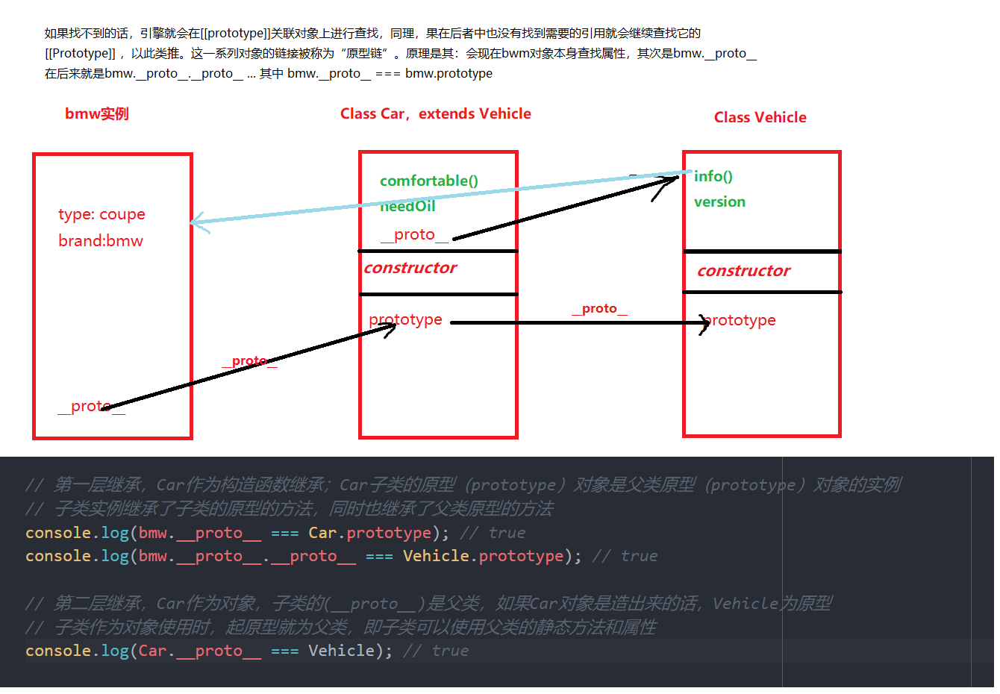

js书籍
===

# 你不知道的javascript

## 1、作用域

### 1.1  js的执行分为两个阶段

*   编译阶段，编译阶段会处理代码中的声明，并把变量放置与作用域中存储；并生成可被js引擎执行的代码

```js
  var x = 2;// 编译阶段处理var x ，对x进行声明 ，x = 2 为赋值语句，需要js引擎去执行
  function foo (a) {console.log(a)};// 编译阶段对函数进行声明，声明的同时对其已经赋值了（函数特殊）
```

*   js引擎执行阶段，引擎执行编译生成的代码；引擎执行时，面对变量会在作用域内进行查找
>   查找分为LHS引用，和RHS引用；简单来说LHS，找到变量容器本身，并进行赋值；RHS则是找到源式值
>   函数执行时，函数内部的代码会再次执行一次，同样也会走编译--执行的流程；

*   函数的词法作用域，无论函数在哪里被调用，也无论它被如何调用，它的词法作用域只是由函数被声明时所处的位置所决定的；（作用域是由编译阶段所确定的，也是由书写时函数声明的位置所决定的，编译的词法分析阶段基本能够知道全部的标示符在哪里以及是如何声明的，从而能够预测在执行过程中如何对他们进行查找）
*   不要使用`with` 和 `eval`，这样会使得程序无法对代码进行优化；

### 1.2 闭包

> 无论通过何种方式将内部函数传递到所在的词法作用域之外，它都会持有对原始作用域的引用，无论在何处
> 由于函数可以被当成第一级的值并到处传递，那么函数在执行时，会带有对：由函数定义时形成的词法作用域的引用，这就是闭包
> 只要使用了**回调函数** 就是在使用闭包

*   无论函数是具名函数还是匿名函数，实际上都牵扯到了函数的定义，通常情况下，匿名函数不仅在声明函数而且会把函数传递到对应执行器中去；比如
*   函数的作用域，是由函数定义时决定的，也就是位置决定的


```js
setTimeout(function () {...}, 1000);// 实际上当执行到此的时候，同样会对函数进行定义，只不过没办法在此引用这个函数，并且函数会被传递到执行器中
axios.get(url).then(function () {...})

```

*   闭包也可以这样去理解，当函数作为值进行传递的时候，函数的作用域如何处理
*   到了ES6，`let` 和 `const` 会使得代码块`{}` 变成块级作用域，同样会实现闭包的效果
*   通过JS的任何值都能作为返回值的特性，使用函数可以实现模块的功能（当然ES6 module是原生实现）模块
*   ES6模块：1、js原生支持的；2、js运行时，编译器会在编译阶段检查导入的模块API成员的引用是否存在，若不存在会抛出早期的错误；


```js
    function module () {
    var a = '12';
    var b = [1,2,5];

    function doSomething () {
        ...
    }


    function doElseSomething () {
        console.log(a);
    }

    return {
        doSomething: doSomething,
        doElseSomething: doElseSomething
    }
    }
    var x = module();
    x.doSomething();
```

## 3、对象

JavaScript 中的对象有字面形式（比如 var a = { .. } ）和构造形式（比如 var a = new
Array(..) ）。字面形式更常用，不过有时候构造形式可以提供更多选项。

许多人都以为“JavaScript 中万物都是对象”，这是错误的。对象是 6 个（或者是 7 个，取
决于你的观点）基础类型之一。对象有包括 function 在内的子类型，不同子类型具有不同
的行为，比如内部标签 [object Array] 表示这是对象的子类型数组。

对象就是键 / 值对的集合。可以通过 .propName 或者 ["propName"] 语法来获取属性值。访
问属性时，引擎实际上会调用内部的默认 [[Get]] 操作（在设置属性值时是 [[Put]] ），
[[Get]] 操作会检查对象本身是否包含这个属性，如果没找到的话还会查找 [[Prototype]]
链（参见第 5 章）。

属性的特性可以通过属性描述符来控制，比如 writable 和 configurable 。此外，可以使用
Object.preventExtensions(..) 、 Object.seal(..) 和 Object.freeze(..) 来设置对象（及其
属性）的不可变性级别。

属性不一定包含值——它们可能是具备 getter/setter 的“访问描述符”。此外，属性可以是
可枚举或者不可枚举的，这决定了它们是否会出现在 for..in 循环中。

你可以使用 ES6 的 for..of 语法来遍历数据结构（数组、对象，等等）中的值， for..of
会寻找内置或者自定义的 @@iterator 对象并调用它的 next() 方法来遍历数据值。

## 4、类
> 面向对象编程强调的是数据和操作数据的行为本质上是互相关联的（当然，不同的数据有
不同的行为），因此好的设计就是把数据以及和它相关的行为打包（或者说封装）起来。
这在正式的计算机科学中有时被称为数据结构。

软件思想对现实问题的一种抽象（abstract）；类（class） 继承（inhert） 实例（instance）
类 / 继承描述了一种代码的组织结构形式——一种在软件中对真实世界中问题领域的建模方法

在ES6中通过以下方式创建类，并实例化

```js

class Car {// 类，类内部定义的方法都是不可枚举的
  constructor(name) {
  	this.name = name;
  }
  sayHello() {
  	console.log('say hello');
  }
}

class bmw extends Car {
  constructor(name, str) {
  	super(name);
    this.str = str;
  }
}
```
ES6的继承是子类实例的构建，是基于父类实例加工；

定义时：
* es6中无法定义私有属性和私有方法，
* 因为 ES6 明确规定，Class 内部只有静态方法，static没有静态属性。
* ES6目前没有私有方法和私有属性
* ES6目前只能在constructor内定义属性，而不能在constructor外定义，

继承时：
* 使用`super`的时候，必须显式指定是作为函数、还是作为对象使用，否则会报错。
* super 作为函数时，只能用在子类的构造函数中constructor，其他地方报错。
* super作为对象时，在普通方法中，指向父类的原型对象；在静态方法中，指向父类。
* ES6 规定，通过super调用父类的方法时，方法内部的this指向子类





javascript 中对于“构造函数”最准确的解释是，所有带`new`的函数调用；函数不是构造函数，但是当且仅当使用 new 时，函数调用会变成“构造函数调用”。**prototype**可以认为是个委托；
javascript中的对象通过委托的方式访问对象本身并没有，而在其原型上的属性和方法；
原型继承之所以能够存在取决于：
* 1、javascript为动态类型的语言
* 2、在访问对象的属性时存在原型链查找，当在属性内部不能找到对应的属性时，会去起对应的原型链上查找，直到最顶层的原型；最后返回值为存在的值或为`undefined`
	

如果要访问对象中并不存在的一个属性， [[Get]] 操作（参见第 3 章）就会查找对象内部
[[Prototype]] 关联的对象。这个关联关系实际上定义了一条“原型链”（有点像嵌套的作用域链），在查找属性时会对它进行遍历。
所有普通对象都有内置的 Object.prototype ，指向原型链的顶端（比如说全局作用域），如果在原型链中找不到指定的属性就会停止。 toString() 、 valueOf() 和其他一些通用的功能都存在于 Object.prototype 对象上，因此语言中所有的对象都可以使用它们。
关联两个对象最常用的方法是使用 new 关键词进行函数调用，在调用的 4 个步骤（第 2章）中会创建一个关联其他对象的新对象。
使用 new 调用函数时会把新对象的 .prototype 属性关联到“其他对象”。带 new 的函数调用通常被称为“构造函数调用”，尽管它们实际上和传统面向类语言中的类构造函数不一样。
虽然这些 JavaScript 机制和传统面向类语言中的“类初始化”和“类继承”很相似，但是 JavaScript 中的机制有一个核心区别，那就是不会进行复制，对象之间是通过内部的[[Prototype]] 链关联的。

出于各种原因，以“继承”结尾的术语（包括“原型继承”）和其他面向对象的术语都无法帮助你理解 JavaScript 的真实机制（不仅仅是限制我们的思维模式）。
相比之下，“委托”是一个更合适的术语，因为对象之间的关系不是复制而是委托


## 5、类型
javascript中变量是没有类型的，（变量是值得容器）只有值才有类型，变量在使用时代表的是变量对应的值，并且变量可以随时持有任何类型的值。
```
undefined == 'undefined';// false
```
已在作用域中声明但还没有赋值的变量，是 undefined 的。相反，还没有在作用域中声明
过的变量，是 undeclared 的。
```
var a;
a; // undefined
b; // ReferenceError: d is not defined 
typeof a; // 'undefined'
typeof b;// 'undefined'
```
**总结**
JavaScript 有 七 种 内 置 类 型： null 、 undefined 、 boolean 、 number 、 string 、 object 和
symbol ，可以使用 typeof 运算符来查看。
变量没有类型，但它们持有的值有类型。类型定义了值的行为特征。
很多开发人员将 undefined 和 undeclared 混为一谈，但在 JavaScript 中它们是两码事。
undefined 是值的一种。undeclared 则表示变量还没有被声明过。
遗憾的是，JavaScript 却将它们混为一谈，在我们试图访问 "undeclared" 变量时这样报错：ReferenceError: a is not defined，并且 typeof 对 undefined 和 undeclared 变量都返回"undefined" 。
然而，通过 typeof 的安全防范机制（阻止报错）来检查 undeclared 变量，有时是个不错的办法。

## 6、值
使用`Number.isNaN()`来代替`window.isNaN()` number的方法只有参数为`NaN`时返回`true`
window的只要不是数字都是返回`true`
`object.is(a,b)` 用于处理包含特殊情况（NaN，0，-0）判断是否相等；
值复制和引用复制，我们无法自行决定使用值复制还是引用复制，一切由值的类型来决定。在赋值操作和参数传递的时候，会出现这种情况。
**总结**
JavaScript 中的数组是通过数字索引的一组任意类型的值。字符串和数组类似，但是它们的行为特征不同，在将字符作为数组来处理时需要特别小心。JavaScript 中的数字包括“整数”和“浮点型”。
基本类型中定义了几个特殊的值。

null 类型只有一个值 null ， undefined 类型也只有一个值 undefined 。所有变量在赋值之前默认值都是 undefined 。 void 运算符返回 undefined 。

数 字 类 型 有 几 个 特 殊 值， 包 括 NaN （ 意 指“not a number”， 更 确 切 地 说 是“invalid
number”）、 +Infinity 、 -Infinity 和 -0 。

简单标量基本类型值（字符串和数字等）通过值复制来赋值 / 传递，而复合值（对象等）通过引用复制来赋值 / 传递。JavaScript 中的引用和其他语言中的引用 / 指针不同，它们不能指向别的变量 / 引用，只能指向值。

## 7、内置函数（native function）

**String() Number() Boolean() Array() Function() Object() RegExp() Date() Error() Symbol()**
通过`new String('232')` 创造的为`'232'`的**封装对象**

封装对象（object wrapper）扮演着十分重要的角色。由于基本类型值没有 .length和 .toString() 这样的属性和方法，需要通过封装对象才能访问，此时 JavaScript 会自动为基本类型值包装（box 或者 wrap）一个封装对象：
```
var a = 'abc';
a.length; // 3
```
通常情况下我们只要知道，封装对象存在，以及在某些运算中会自动执行即可，不推荐直接使用封装对象。js会对封装对象在必要的时候进行拆分通过`valueOf`方法；
对于基本类型的值，js在运算的过程中会发生隐式的封装 和 隐式的拆分；


