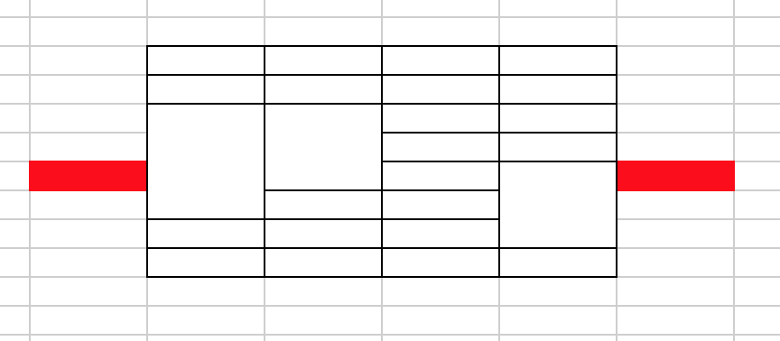

## 学习

#### 一、目前学习的方向

现在首要做的就是，学习前端部分的基础知识，把JS的基础知识和node掌握了。因此这段时间的笔记更多的是一些知识点的积累和问题的解决。很难做到有完整的博客，和完整的文章出来。这段学习经历过之后，自己对整体的Web应用，就有了一个完整的，基于自己的认识。这时候可能会发现前后端的界限就不是那么的清晰了，这时候你就能够站在整个应用的角度，来分析问题，解决问题。这个时候做出的分析和判断才会更有价值。这样虽做不到能够掌控全局，但是最基本的认知和理解就有了。对自己来说后端就不再是黑盒了。

另外我需要学习和思考的就是，解决问题，分析问题，并最终能搞明白问题的能力。技术文章的辨别能力，找到原始技术答案的能力。技术问题要想确定就必须，要有追本朔源的认知，必须要找找起内部到底是怎么样来实现的。
对技术文章的辨别能力。
自己去解决问题，总结知识的能力。解决问题并不意味着，不去看别人的文章和去求教别人。重点是要把问题给真正的用自己的方式搞明白。
最后肯定是要去积累的。可以通过这种文章的方式记录自己的思考、总结。

#### 三、项目开始阶段需要准备的内容（用于把控整个项目）
* 需求文档（通常需求来做，并且都是word，这是整个项目的基础）
* 原型图（通常由需求来做，新的会做出AXURE RP ，老的需求Excel 项目demo啥的都有。原型体现需求对功能的一系列的描述，也是开发和设计的依据；
* 效果图（通常由设计来做，包含：交互设计和视觉设计，这是实际开发的依据）

#### 四、表格分页打印重构总结
> 表格分页打印是指，档案项目中，由于档案内容比较多，需要对档案的表格内容进行分页打印。

要点：分页打印后，每一页都必须要有公用的头部和尾部，尾部有页数，头部包含表头和正文内容中表格头部。更关键的问题是正文里面的内容是有大类和小类之分的，需要在分割打印后大小类也要保持原有的结构。

难点：在与如何分割好复杂的内容部分。如图红色部分为分割的正文部分，其中第一列第二列第四列在红色切割部分存在者不同程度的跨行。解决问题的关键就是如何才能够把跨行部分处理好。并且如果一整块区域过长，剩余部分需要在此进行分页处理。

思路：计算高度，对块标记区域进行循环高度计算，计算出需要处理的区域块，并对区域块中的行进行处理。对DOM进行处理，使的在分割点分割后仍然能够合理的显示。即便如此真正的代码实现仍然是一个很复杂的问题。因此在开发的时候对大功能进行拆分，把各个部分功能的实现拆分到各个函数里面，并保证每个函数返回简单的固定的值。通过各个功能函数的调用，实现整体的功能。在第一轮次反馈bug的时候，当有一种情况没有考虑到的时候，通过对组装函数的修改和原有函数的复用。通过添加对应的功能函数很容易实现原有功能的补充。

#### 五、前端工作
**数据展现**： 数据模型(Modal) 到 视图(View)的映射；
**用户交互**：响应用户操作，对用户操作做出反馈；
前端工作，数据驱动，1、设计数据模型；2、实现页面；3、添加响应；

